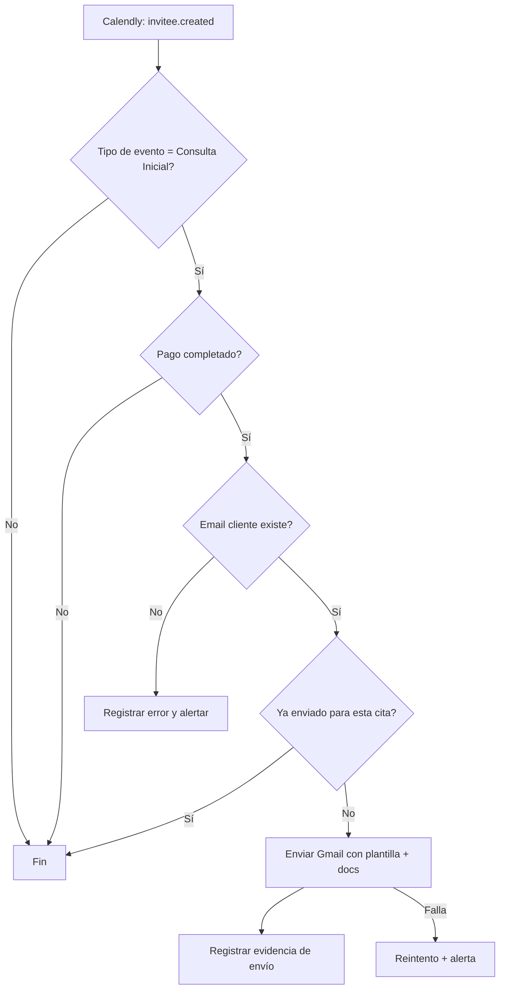

# Automatización recomendada: Calendly + Stripe + Gmail (Consulta Inicial)

## 1) Recomendación ejecutiva (estable, segura y simple)

**Recomendación principal: Zapier** con un solo Zap, más una tabla de control (Storage by Zapier o Google Sheets/Airtable) para idempotencia.

### ¿Por qué Zapier para tu caso actual?
- **Simplicidad operativa**: sin servidor propio, sin mantenimiento de infraestructura.
- **Tiempo de implementación corto**: puedes tener un MVP en horas.
- **Buena trazabilidad**: historial de ejecuciones y errores por tarea.
- **Mantenible por personal no técnico**: ideal para práctica privada.

### Cuándo preferir Make o código custom
- **Make**: si quieres lógica visual más compleja (ruteos, ramas, validaciones múltiples) y potencialmente costo menor a gran volumen.
- **Código custom**: si necesitas máximo control, políticas estrictas de cumplimiento, auditoría avanzada, integración profunda con EHR/CRM y extensibilidad empresarial.

---

## 2) Arquitectura recomendada (fase 1)

## Componentes
1. **Calendly**: fuente del evento de cita creada.
2. **Stripe (vía Calendly)**: confirma pago exitoso.
3. **Zapier**: orquesta trigger + validaciones + envío + logging.
4. **Gmail**: envío del correo con plantilla y adjuntos/enlaces.
5. **Data Store (idempotencia y evidencia)**:
   - Opción A: Storage by Zapier.
   - Opción B: Google Sheets (recomendado si quieres ver bitácora fácil).

## Flujo lógico


---

## 3) Campos que debes capturar

Del evento (y/o consulta adicional a API):
- `first_name`
- `last_name`
- `email`
- `event_start_time`
- `event_end_time` (opcional)
- `event_type_name` (o URI)
- `payment_status`
- `scheduled_event_uri` / `event_uuid`
- `invitee_uri` / `invitee_uuid`

**Clave de deduplicación recomendada**:
- `dedupe_key = invitee_uri` (siempre que sea único por booking)
- respaldo: `event_uuid + email`

---

## 4) Implementación exacta en Zapier (paso a paso)

## Paso 0: Preparación
1. En Calendly, confirma que la consulta inicial sea un **Event Type** claramente nombrado (ej. `Consulta Inicial - 60 min`).
2. En el Event Type, activa cobro por Stripe (`Require payment to book this meeting`).
3. Define si enviarás:
   - **Adjuntos** (PDFs en Gmail), o
   - **Links** (Drive/portal seguro; recomendado para control de versiones).

## Paso 1: Trigger
1. Crea un Zap.
2. Trigger app: **Calendly**.
3. Evento trigger: **Invitee Created** (o equivalente en tu conector actual).
4. Conecta cuenta Calendly.
5. Prueba trigger con una cita real/sandbox.

## Paso 2: Filtro por tipo de evento
1. Añade paso **Filter by Zapier**.
2. Condición: `event_type_name` contiene `Consulta Inicial`.
3. Si no cumple, Zap termina.

## Paso 3: Verificación de pago
1. Segunda condición en Filter (o paso separado):
   - `payment_status == paid` (o valor equivalente del payload de Calendly).
2. Si no hay ese campo en tu trigger, añade un paso intermedio:
   - Webhooks by Zapier para consultar endpoint de Calendly/Stripe y confirmar estado.

## Paso 4: Validación de email
1. Filtro: `invitee_email` existe y tiene formato válido.
2. Si no existe:
   - Registrar en bitácora con estado `ERROR_MISSING_EMAIL`.

## Paso 5: Detección de duplicados (idempotencia)
1. Busca `dedupe_key` en Storage/Sheet.
2. Si existe y `status=SENT`, detener.
3. Si no existe, continuar.

## Paso 6: Envío Gmail
1. Acción: **Gmail – Send Email**.
2. `To`: email del cliente.
3. `Subject`: `Documentación requerida antes de su consulta inicial`.
4. `Body`: plantilla fija (editable).
5. Adjunta 4 documentos (o inserta 4 links).

## Paso 7: Evidencia/log
1. Guardar registro con:
   - `dedupe_key`
   - fecha/hora de envío
   - destinatario
   - event_type
   - payment_status
   - `gmail_message_id` (si disponible)
   - `status = SENT`

## Paso 8: Manejo de errores
1. Configura reintentos automáticos de Zapier.
2. Ruta de error:
   - Crear fila con `status=FAILED` y `error_detail`.
   - Notificación interna (email tuyo/Slack).

---

## 5) Plantilla lista (editable)

**Asunto**
`Documentación requerida antes de su consulta inicial`

**Cuerpo**
```text
Saludos,
Gracias por separar su consulta inicial.

Antes de su cita, es requisito completar y revisar la documentación correspondiente. En este correo se incluye la siguiente información:

- Consentimiento informado
- Documento HIPAA
- Historial inicial
- Tabla de servicios

Le agradezco que complete estos documentos antes de la fecha de su consulta para poder comenzar el proceso de manera adecuada.

Atentamente,
Lcda. Myrna Ortiz-Rodríguez
Psicóloga
```

---

## 6) Autenticación por plataforma

## Calendly
- Método recomendado: token personal (PAT) para API/webhooks o conexión OAuth vía Zapier.
- Permisos mínimos necesarios para leer eventos/invitees.

## Stripe
- Si validas desde Stripe directamente (opcional), usa webhook firmado con `whsec_...`.
- Verifica firma del webhook siempre.

## Gmail
- Conexión OAuth 2.0 en Zapier (cuenta Gmail o Google Workspace).
- Si es entorno clínico, considera Google Workspace con controles de seguridad, retención y auditoría.

---

## 7) Control de errores y duplicados (diseño recomendado)

## Reglas de idempotencia
- Antes de enviar: `if dedupe_key exists && status == SENT => skip`.
- Después de enviar: guardar estado `SENT` con timestamp.

## Reglas de error
- `MISSING_EMAIL`: no enviar, registrar y notificar.
- `PAYMENT_NOT_CONFIRMED`: no enviar.
- `GMAIL_SEND_FAILED`: reintentar 3 veces con backoff.
- `UNKNOWN_ERROR`: registrar payload resumido y alertar.

## Auditoría mínima
Guardar por cada intento:
- `event_uuid`, `invitee_uuid`, `email`, `payment_status`, `attempt`, `status`, `error`, `sent_at`, `message_id`.

---

## 8) Base funcional si decides código custom (FastAPI + Webhooks)

> Esta base te da control total. Úsala si luego quieres expediente, DB clínica, y lógica multicanal (ATH Móvil, etc.).

```python
# app.py
import os
import sqlite3
from datetime import datetime
from fastapi import FastAPI, Request, HTTPException
from pydantic import BaseModel

app = FastAPI()
DB = "automation.db"

SUBJECT = "Documentación requerida antes de su consulta inicial"
BODY_TEMPLATE = """Saludos,\nGracias por separar su consulta inicial.\n\nAntes de su cita, es requisito completar y revisar la documentación correspondiente.\n\n- Consentimiento informado\n- Documento HIPAA\n- Historial inicial\n- Tabla de servicios\n\nAtentamente,\nLcda. Myrna Ortiz-Rodríguez\nPsicóloga\n"""

DOC_LINKS = [
    "https://tu-drive/consentimiento.pdf",
    "https://tu-drive/hipaa.pdf",
    "https://tu-drive/historial.pdf",
    "https://tu-drive/tabla-servicios.pdf",
]

def init_db():
    with sqlite3.connect(DB) as con:
        con.execute(
            """
            CREATE TABLE IF NOT EXISTS sends (
              dedupe_key TEXT PRIMARY KEY,
              invitee_email TEXT,
              event_uuid TEXT,
              payment_status TEXT,
              status TEXT,
              error TEXT,
              message_id TEXT,
              created_at TEXT
            )
            """
        )

init_db()


def already_sent(dedupe_key: str) -> bool:
    with sqlite3.connect(DB) as con:
        row = con.execute(
            "SELECT status FROM sends WHERE dedupe_key=?", (dedupe_key,)
        ).fetchone()
        return row is not None and row[0] == "SENT"


def log_send(dedupe_key, invitee_email, event_uuid, payment_status, status, error=None, message_id=None):
    with sqlite3.connect(DB) as con:
        con.execute(
            """
            INSERT OR REPLACE INTO sends
            (dedupe_key, invitee_email, event_uuid, payment_status, status, error, message_id, created_at)
            VALUES (?, ?, ?, ?, ?, ?, ?, ?)
            """,
            (
                dedupe_key,
                invitee_email,
                event_uuid,
                payment_status,
                status,
                error,
                message_id,
                datetime.utcnow().isoformat(),
            ),
        )


def send_gmail(to_email: str, subject: str, body: str, links: list[str]) -> str:
    # Placeholder: reemplazar con Gmail API users.messages.send
    # Devuelve message_id si se envió correctamente
    print(f"Sending to {to_email}: {subject}\n{body}\n{links}")
    return "mock_message_id_123"


@app.post("/webhooks/calendly")
async def calendly_webhook(req: Request):
    payload = await req.json()

    # 1) Trigger esperado
    event = payload.get("event")  # ej: invitee.created
    if event != "invitee.created":
        return {"ok": True, "ignored": "not invitee.created"}

    p = payload.get("payload", {})
    event_type_name = (p.get("event_type") or {}).get("name", "")
    email = (p.get("email") or "").strip().lower()
    payment_status = (p.get("payment") or {}).get("status", "unknown")
    event_uuid = (p.get("scheduled_event") or {}).get("uuid", "")
    invitee_uri = p.get("uri", "")

    # 2) Validaciones
    if "consulta inicial" not in event_type_name.lower():
        return {"ok": True, "ignored": "not initial consult"}

    if payment_status not in ["paid", "succeeded", "complete"]:
        return {"ok": True, "ignored": "payment not completed"}

    if not email:
        log_send(invitee_uri or event_uuid, email, event_uuid, payment_status, "FAILED", "MISSING_EMAIL")
        raise HTTPException(status_code=400, detail="Missing invitee email")

    dedupe_key = invitee_uri or f"{event_uuid}:{email}"

    if already_sent(dedupe_key):
        return {"ok": True, "ignored": "duplicate"}

    # 3) Acción
    try:
        msg_id = send_gmail(email, SUBJECT, BODY_TEMPLATE, DOC_LINKS)
        log_send(dedupe_key, email, event_uuid, payment_status, "SENT", None, msg_id)
        return {"ok": True, "sent": True, "message_id": msg_id}
    except Exception as e:
        log_send(dedupe_key, email, event_uuid, payment_status, "FAILED", str(e))
        raise HTTPException(status_code=500, detail="Gmail send failed")
```

---

## 9) Checklist de pruebas (fase 1)

1. **Caso feliz**: Consulta Inicial + pago completado -> correo enviado + registro `SENT`.
2. **No inicial**: Seguimiento -> no envía.
3. **Sin pago**: agenda creada sin cobro -> no envía.
4. **Sin email** -> no envía, registra `FAILED`.
5. **Duplicado**: reintento del mismo evento -> no reenvía.
6. **Fallo Gmail** -> reintenta y registra error.

---

## 10) Preparado para mejoras futuras

Diseña desde ya estos módulos lógicos:
- `event_ingest` (webhook de entrada)
- `validation_engine`
- `delivery_engine` (Gmail)
- `audit_log`
- `storage_adapter` (hoy Sheets/SQLite, mañana Postgres)

Con eso podrás añadir fácilmente:
1. Creación automática de expediente.
2. Guardado de formularios en Google Drive.
3. Registro en base de datos o Google Sheets.
4. Seguimiento de documentos completados.
5. Rama separada para pagos manuales por ATH Móvil.

---

## 11) Decisión final sugerida

Para **tu prioridad inmediata** (Calendly + Stripe + Gmail + Consulta Inicial + envío automático de docs), usa:

- **Fase 1 (ahora): Zapier** con filtros + idempotencia + bitácora.
- **Fase 2 (cuando escales): código custom** reutilizando las mismas reglas de validación y auditoría.

Esto te da **resultado rápido hoy** sin cerrar la puerta a una arquitectura más robusta mañana.
